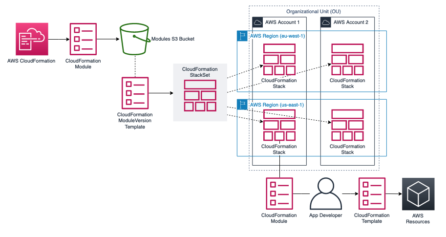

## AWS CloudFormation Module Sharing

This project contains sample templates for deploying CloudFormation Modules across accounts using CloudFormation StackSets



The modules folder contains a sample CloudFormation Module, this can be deployed using the CloudFormation CLI:

```
cd modules
cfn validate
cfn submit
```

For more details see the CloudFormation CLI guide: https://docs.aws.amazon.com/cloudformation-cli/latest/userguide/modules-develop.html

The templates folder contains 2 CloudFormation Templates:

- _aws-cloudformation-module_ - This template can be used to create a CloudFormation Module based on a registered type. You can use this template when creating a StackSet using the AWS Console to deploy the module to multiple Organizational Units or across the entire Organization.
- _aws-cloudformation-module-sharing_ - This template can be used to deploy a CloudFormation Module in a CloudFormation StackSet targeting multiple AWS Regions and multiple AWS Accounts. To do this you must have followed the steps outlined here to enable Self-Managed permissions for CloudFormation StackSets: https://docs.aws.amazon.com/AWSCloudFormation/latest/UserGuide/stacksets-prereqs-self-managed.html. This includes creating the role in any target account, which can be done using this CloudFormation template: https://s3.amazonaws.com/cloudformation-stackset-sample-templates-us-east-1/AWSCloudFormationStackSetExecutionRole.yml
- _aws-cloudformation-module-consumer_ - This template shows how member accounts can then consume the shared resource as a part of their own CloudFormation templates

## Security

See [CONTRIBUTING](CONTRIBUTING.md#security-issue-notifications) for more information.

## License

This library is licensed under the MIT-0 License. See the LICENSE file.
